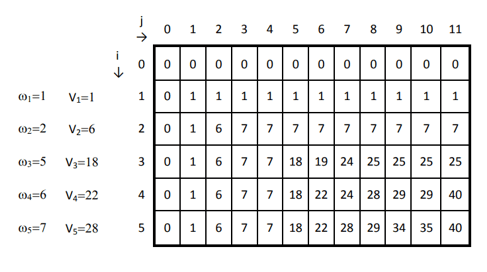

# Dynamic Programming problems

## Knapsack (0-1) Bounded

Here, you are given the profits and weights of N items, and you have to put these items in a knapsack with the capacity ‘W’, and you have to find the number of items to be selected such that it is less than or equal to the knapsack capacity. The knapsack problem is the perfect example of a dynamic programming algorithm and the most commonly asked question in a technical interview of product-based companies.

Problem Statement: Given a bag with capacity W, and a list of items along with their weights and profit associated with them. The task is to fill the bag efficiently such that max profit is achieved.

Solution: Here, you will create a table dp[][] and consider all possible weights from 1 to W as columns and weights that you can choose as rows. The state /cell dp[i][j] in the table represents the maximum attainable profit if 'j' is the capacity of the knapsack and the first 'i' elements are included in the weight/ item array. Thus the last cell will represent the answer state. Items can only be included if their weight is less than the capacity of the knapsack. There are two possibilities for the condition where you can fill all columns which have ‘weight>wt[i-1]’. Check out these two possibilities in detail as shown in the below problem logic:

```
function kProfit

Case 1: if N=0 and W=0 return 0

Case 2: if wt[N-1] <= W then

dp[N][W] = max(pr[N-1]+kProfit(W-wt[N-1], N-1,wt,pr,dp), kProfit(W,N-1, wt, pr, dp))

return dp[N][W]

Case 3: else

dp[N][W] = kProfit(W,N-1, wt, pr, dp)

return dp[N][W]
```



Sample values:

W = 11

wt = [1, 2, 5, 6, 7]

pr = [1, 6, 18, 22, 28]

The running time complexity of the 0/1 Knapsack problem is O(N*W) where N is the number of items given and W is the capacity of the Knapsack.

